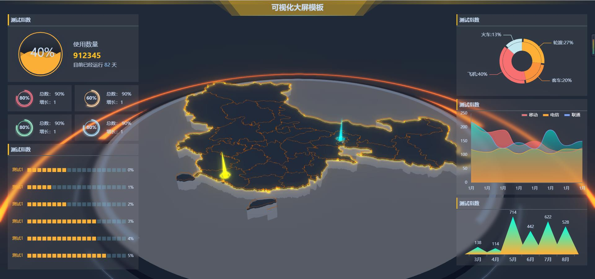

### Vue3+ts+Windcss+Echart+Three.js大屏案例

 
### 包管理工具版本
- ✨node版本`v18.16.1`,16.xx.x也可以
- ✨pnpm版本`8.10.0`,🎈新版采用pnpm安装依赖
### 启动项目流程`注意：地图JSON数据来源与阿里的datax,启动项目必须是有网的情况下才能正常显示地图` 
- 克隆项目
```cmd
git clone https://gitee.com/shaohqfspace/PublicbigScreenPage.git
```
- 进入项目目录
```cmd
cd PublicbigScreenPage
```
- 下载依赖
```cmd
pnpm instll
```
- 运行
```cmd
pnpm run serve
```
### 自定义地图
> 可通过修改`AreaCode`进行自定义地图
```js
let AreaCode = '100000'
onMounted(() => {
  initMaps();
  getGeoJsonall(`${AreaCode}_full`).then((e) => {
    setMapDom(e.data.features);
  });
  getGeoJsonall(AreaCode).then((e) => {
    // console.log()
    setmapborder(e.data.features);
  });
});
``` 
### 提交记录
* 1.7封装Echart钩子
* 1.7 新增Hooks钩子 useEventListener，useEcahrt
* 1.8 新增防抖，节流，定时器，大屏自适应钩子，新增大屏页面
- 报错记录：`Property name "fullWarp" is not PascalCase` 需要首字母大写
* 1.9 新增图标组件
* 1.10 新增世界地图图表
* 1.11 首版大屏搭建完成 
* 4.6 新增3d地图，辉光效果，光柱标注
* 4.13 新增文字标签构造器
* 4.19 球形标点，优化入场动画 
* 4.15 dome1 地球到geojson地图
### 问题记录
- 问题记录：`如果启动的时候会造成页面样式加载失败，请重新安装windicss/vite插件，重新再次运行npm install ,最后执行npm run serve`  